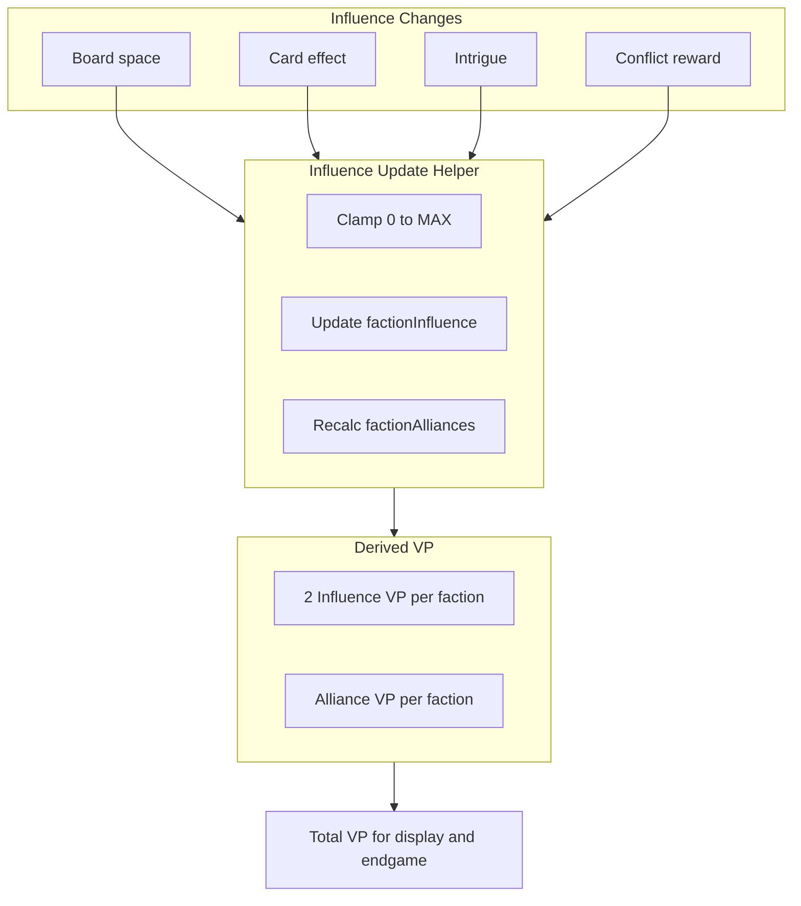

# Influence Victory Points Implementation

## Official Rules (from RulesPal rulebook)

**2 Influence VP:** When you reach 2 influence with a faction, you gain 1 VP. If you drop below 2, you lose it.

**4 Influence Alliance VP:** The first player to reach 4 influence earns the Alliance token and 1 VP. If you are ever passed by an opponent (they have higher influence), you must give the Alliance token to them — you lose that VP and they gain it. If you drop below 4, you also lose the bonus vp

**Max influence:** The physical board has a fixed track. max is 6

**Negative influence:** Some intrigue cards have "lose one influence" (choose faction). The rules allow influence to go down (per terms.mdc).

---

## Architecture

Use **derived state** for influence VPs: compute them from `factionInfluence` whenever needed, rather than mutating `player.victoryPoints` on every influence change. This avoids touching all 6 places that modify influence.

**Total VP** = `player.victoryPoints` (base) + `influenceVictoryPoints(playerId, state)` (derived)

---

## Implementation Plan

### 1. Create influence VP utility module

Create `[client/src/utils/influenceVictoryPoints.ts](client/src/utils/influenceVictoryPoints.ts)`:

- `MAX_INFLUENCE = 6` 
- `computeInfluenceVictoryPoints(state: GameState): Record<number, number>` — returns VP per player from influence:
  - **2-influence rule:** +1 VP per faction where player has >= 2 influence
  - **Alliance rule:** For each faction, player with highest influence (if >= 4) gets +1 VP. Ties: if `factionAlliances[faction]` already has an owner and they're tied, they keep it; otherwise first among tied (by player id order) gets it
- `getTotalVictoryPoints(player: Player, state: GameState): number` — `player.victoryPoints + computeInfluenceVictoryPoints(state)[player.id]`

### 2. Update `factionAlliances` when influence changes

`factionAlliances: Record<FactionType, number | null>` currently exists but is never set. Update it whenever influence changes:

- When a player reaches 4+ and has highest influence: set `factionAlliances[faction] = playerId`
- When another player passes them: set `factionAlliances[faction] = newLeaderId` (and optionally push gains for VP transfer)

**Tiebreaker:** If two players tie for highest at 4+, the current owner keeps it. If no owner and it's a tie, use lowest player id (deterministic).

### 3. Centralize influence updates (single helper)

Create `updateFactionInfluence(state, faction, playerId, delta): GameState` that:

- Clamps `newInfluence` to `[0, MAX_INFLUENCE]`
- Updates `factionInfluence`
- Updates `factionAlliances` for that faction (if new leader at 4+)
- Returns new state

**All influence modification sites** must use this helper (or call a shared post-update hook):

| Location          | File                  | Action                       |
| ----------------- | --------------------- | ---------------------------- |
| Conflict rewards  | GameContext.tsx ~246  | `applyReward` INFLUENCE case |
| Choice rewards    | GameContext.tsx ~472  | `applyChoiceReward`          |
| Intrigue effects  | GameContext.tsx ~559  | `handleIntrigueEffect`       |
| PLACE_AGENT       | GameContext.tsx ~2848 | Board space + card influence |
| CLAIM_ALL_REWARDS | GameContext.tsx ~2920 | Same                         |
| Acquire card      | GameContext.tsx ~2126 | `acquireEffect.influence`    |

### 4. Use total VP everywhere

**Endgame trigger** (line ~1075): Change `p.victoryPoints >= 10` to `getTotalVictoryPoints(p, state) >= 10`.

**Winner determination** (line ~1262): Use `getTotalVictoryPoints` when comparing.

**Display:** `PlayerArea`, `PlayerOverviewModal`, `TurnHistory` — show total VP. Optionally show breakdown (base + influence) on hover or in a tooltip.

### 5. Handle negative influence

Ensure all influence update paths do not support `amount < 0` (e.g. intrigue "lose one influence" cannot be applied when you have 0 influence. Also intrigue cards should count as unplayaable if you have 0 influence). Current code uses `currentInfluence + amount`; add `Math.max(0, Math.min(MAX_INFLUENCE, newValue))` in the helper.

### 6. Gains / history

When Alliance changes hands (player A passed by player B), push gains:

- `{ playerId: A, type: VICTORY_POINTS, amount: -1, source: 'Alliance lost', ... }`
- `{ playerId: B, type: VICTORY_POINTS, amount: 1, source: 'Alliance gained', ... }`

The 2-influence VP is implicit (derived from state); no need to push gains for it unless you want a "Influence VP" gain type for UX.

---

## Key Files

- **New:** `[client/src/utils/influenceVictoryPoints.ts](client/src/utils/influenceVictoryPoints.ts)` — core logic
- **Modify:** `[client/src/components/GameContext/GameContext.tsx](client/src/components/GameContext/GameContext.tsx)` — use helper, update factionAlliances, use total VP for endgame
- **Modify:** `[client/src/components/PlayerArea.tsx](client/src/components/PlayerArea.tsx)`, `[PlayerOverviewModal.tsx](client/src/components/PlayerOverviewModal/PlayerOverviewModal.tsx)` — display total VP

---

---

## Mermaid: Influence VP Flow

