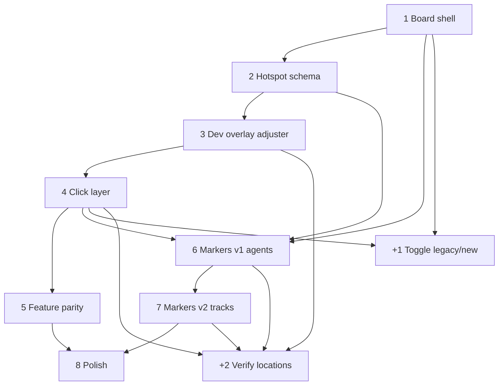

# Interactive full-board image (`Board.jpg`)

## Current state

- `GameBoard` lays out **`BoardSpace`** components in a CSS grid (`board-spaces`).
- Each space uses its own asset under `public/board/` (e.g. `high_council.png`), not the full `Board.jpg`.
- Game logic is keyed by stable **`space.id`** and `BOARD_SPACES` in `boardSpaces.ts` — that contract can stay; only presentation and hit-testing change.

## Goal

- One full `Board.jpg` as the visual.
- **Clickable regions** per board space (replacing the grid of cutouts).
- **Counters** (agents, influence cubes, VP/combat markers, troops, etc.) at fixed positions on the art.
- **Toggle** between the legacy grid board and the new full-image board while the new approach is built.

## Task list (8 + 2)

| # | Task | Notes |
|---|------|--------|
| **1** | **Board shell** | Responsive wrapper, correct **aspect ratio** for `Board.jpg`; single image layer; same coordinate box for all future overlays (% or 0–1). |
| **2** | **Hotspot schema + data module** | TS types for `space.id` → region(s); empty or stub entries; single-file or split import from `boardSpaces` ids. |
| **3** | **Tiny dev overlay + adjuster** | In dev (or behind a flag): draw/edit rects on top of the board, drag corners or numeric fields, **live-adjust** `%** positions, export/copy JSON into the hotspot module. Not for production UI. |
| **4** | **Click layer + wiring** | Transparent hit targets for every `BOARD_SPACES` entry; pipe into existing `GameBoard` props/handlers (`onSpaceClick`, enabled/disabled, etc.). |
| **5** | **Feature parity** | Highlights, `Voice`, Sell Melange / Selective Breeding, recall mode, blocked spaces — same behavior as legacy grid. |
| **6** | **Marker anchors v1** | Agents (and any space-local tokens) at `%` anchors per `space.id`. |
| **7** | **Marker anchors v2** | Influence tracks, VP track, combat track, conflict/garrison regions as needed. |
| **8** | **Polish** | `pointer-events` on image vs overlays, touch targets, stacking (`z-index`), optional debug outline mode. |
| **+1** | **Toggle: legacy vs new board** | UI control (dev toolbar, settings, or always-visible) to switch between current `GameBoard` layout and the new full-image implementation without removing the old path. |
| **+2** | **Verify locations** | Manual QA pass and/or checklist: each hotspot aligns with art at multiple viewport sizes; markers sit on intended slots; document gaps. Can add screenshot or visual regression later. |

### Task dependencies

Rough order: **1 → 2 → 3** (data + authoring), then **4 → 5** (playable new board). **6 → 7** (markers) can start after **1 + 2** share the same coordinate system; **6** is easier after **4** so clicks and agents agree. **8** after **5** and **7**. **+1** is useful as soon as **1** exists (toggle to empty/placeholder new board); fully meaningful after **4**. **+2** runs after **3 + 4** (hotspots) and again after **6 + 7** (markers).

## What we need (reference)

### Board stage with fixed geometry

- Wrapper that preserves the **same aspect ratio** as `Board.jpg`.
- All overlays use the **same coordinate system** — typically **percentages of width/height** (or normalized 0–1) so layout scales on resize.

### Hotspots per board space

- Mapping: **`space.id` → hit region** on the image.
- **Rectangles** (`left`, `top`, `width`, `height` as % of the board) are enough for most spaces.
- **Polygons** (SVG or multiple rects) if shapes are skewed or need a tighter fit.

**Implementation options:**

- Stack: `position: relative` → `` or `background-image` → absolutely positioned transparent `<button>` / `
` per space (% positioning).
- SVG overlay: `<svg viewBox="...">` with embedded board image + `<rect>` / `<polygon>` and `pointer-events`.
- `<map>` / `<area>`: possible but awkward for responsive % coordinates.

### Anchor points for counters (separate from click areas)

| Use | Notes |
|-----|--------|
| Agents on spaces | One anchor (or stack region) per `space.id` |
| Faction influence | 4 tracks × 5 steps → fixed points |
| Victory points | Points for 0–12 on VP track |
| Combat strength | Points for 1–20 on combat track |
| Troops / conflict | Map to combat circles and per-location garrison areas as per game rules |

Render as absolutely positioned elements at the same % coordinates (e.g. center anchors with `transform: translate(-50%, -50%)`).

### Wiring to existing behavior

- Keep `handleSpaceClick`, `canPayCosts`, `highlightedAreas`, `occupiedSpaces`, `blockedSpaces`, Sell Melange popup, Selective Breeding, Voice, etc.
- Only **`GameBoard` presentation** changes: one image + overlays that invoke the same handlers with `space.id`.

### UX / technical notes

- **Pointer events:** Avoid the `` capturing clicks (`pointer-events: none` on the image if controls sit above).
- **Touch / a11y:** Minimum tap targets (~44px) may require slightly larger hit rects than the printed art; consider focus rings for keyboard users.
- **Responsive:** If using `object-fit: contain` + letterboxing, overlays must align to the **same box** as the visible image, not the viewport.

## Optional: two-agent harness (generator + verifier)

Goal: one process **implements** tasks; another **checks** against this plan and returns structured feedback; repeat until you stop or acceptance is met.

**Ideas (no single built-in Cursor feature for infinite loops):**

1. **Manual cadence** — After each chunk of work, paste a short “verifier” prompt: checklist from **+2 Verify locations**, dependency order, and “report pass/fail per criterion.” You control how many rounds.
2. **Cursor Composer / two chats** — Chat A: “implement task N.” Chat B: “review diff against `plans/interactive-board.md` task N; list gaps.” You paste B’s output back into A.
3. **Scripted loop (external)** — A script runs N iterations: call API A (code edit or patch), run tests + linters, call API B (review JSON), append log; stop on green tests or max iterations. Requires your own API keys and glue code.
4. **CI as verifier** — Agent 1 (human or local) pushes branches; **CI** runs build, unit tests, optional Playwright on board toggle; “verifier” is deterministic. Review agent only for non-automatable checks (visual alignment).
5. **Background agents / subagents** — Use Cursor’s agent features to run “implement” vs “review” as separate invocations; you still set the loop count and when to merge.

**Practical pattern:** Keep a **machine-readable checklist** per task (already in this doc); verifier returns `{ taskId, pass, findings[] }`; generator addresses `findings` in the next loop. You cap loops (e.g. 5) or stop when **+2** is satisfied.

## Summary

Deliverables:

1. Responsive, aspect-locked frame with `Board.jpg`.
2. **Hotspot map:** `space.id` → region(s) for clicks (authored with **tiny dev overlay + adjuster**).
3. **Marker map:** normalized positions for influence, VP, combat, agents, troops, etc.
4. **Toggle** between legacy and new board; **verification** of locations.

Existing **`BOARD_SPACES` IDs** remain the integration seam between data and UI.
